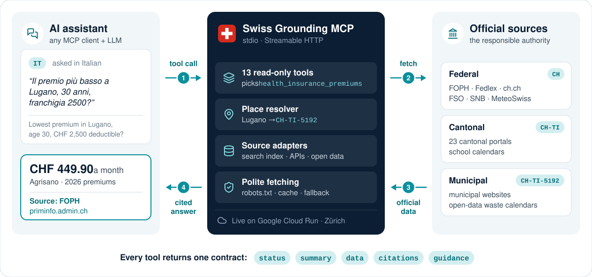

<div align="center">


# Swiss Grounding MCP

**Answers about Switzerland, with the source.**

An MCP server that grounds AI assistants in official federal, cantonal and municipal information,<br>
in German, French, Italian, Romansh and English, and cites the responsible authority in every answer.

[](https://swiss-grounding-mcp-542630986415.europe-west6.run.app/)
[](https://github.com/Gastaan/swiss-grounding-mcp/actions/workflows/hosted-check.yml)
[](https://github.com/Gastaan/swiss-grounding-mcp/actions/workflows/ci.yml)
[](https://registry.modelcontextprotocol.io/v0/servers?search=io.github.soheil1lotfi/swiss-grounding-mcp)
[](https://github.com/Gastaan/swiss-grounding-mcp/pkgs/container/swiss-grounding-mcp)

</div>

## Try it live

<table>
<tr>
<td align="center" width="170">
<a href="https://swiss-grounding-mcp-542630986415.europe-west6.run.app/"></a>
<br><sub>Scan to open it on your phone</sub>
</td>
<td>

**Running on Google Cloud Run in Zürich** (`europe-west6`), deployed from `main`.<br>
Public and read-only: no sign-up, no API key.

**Live server:** [swiss-grounding-mcp-542630986415.europe-west6.run.app](https://swiss-grounding-mcp-542630986415.europe-west6.run.app/)<br>
**MCP endpoint** (Streamable HTTP):<br>
`https://swiss-grounding-mcp-542630986415.europe-west6.run.app/mcp`<br>
**Health:** [`/health`](https://swiss-grounding-mcp-542630986415.europe-west6.run.app/health)

</td>
</tr>
</table>

Add it to an assistant in one line, e.g. Claude Code ([other clients](#connect-an-mcp-client)):

```sh
claude mcp add --transport http swiss https://swiss-grounding-mcp-542630986415.europe-west6.run.app/mcp
```

It scales to zero when idle, so the first request after a pause starts an instance (about 2 s; hybrid
search follows about 10 s later, keyword search answers meanwhile). It is rate-limited per client,
refuses browser origins and is [checked every 6 hours](.github/workflows/hosted-check.yml). The hosted
instance runs the code in this repository, which also [runs locally](#run-it-yourself).

## How it works

<p align="center">
  
</p>

<p align="center"><sub>The example is sample question 3 of the challenge brief, answered by the live server.</sub></p>

Ask a general-purpose assistant about Switzerland and it may answer for the wrong canton, from an
outdated page or from a neighbouring country. Swiss Grounding MCP gives it the responsible authority's
own data instead:

1. **One tool call.** The assistant picks one of 13 read-only tools. Places work as people write them:
   *Genf, Ginevra, Genève*, *Schuls → Scuol*, *8003*, *Bahnhofstrasse 1, Zürich*.
2. **The right authority.** Answers come from the level that is responsible (federal office, canton or
   municipality), through a prebuilt index of 10,630 official pages (keyword + multilingual semantic
   search), live federal APIs and municipal open data.
3. **Polite and resilient.** robots.txt and terms of use are respected by default, requests are paced
   and cached, and when a source is down a dated copy is served or the source is named.
4. **One cited answer.** Every tool returns the [same contract](docs/contract.md), with verbatim
   excerpts and one of five statuses that tell the assistant what to do:

| `ok` | `needs_context` | `not_covered` | `not_found` | `source_error` |
|:---:|:---:|:---:|:---:|:---:|
| answers, with the source | asks one precise question back | says it is outside Switzerland or the scope | says nothing was found, never guesses | names the source that is down |

## Coverage

The declared scope: what the server answers, for which area, from which authority. Assistants can read
it too, with the `swiss_coverage` tool.

| Topic and tool | Geography | Source (authority) | Freshness |
|---|---|---|---|
| **Procedures, rules, fees, deadlines** — permits & migration, moving & registration, taxes, social insurance (AHV/IV), unemployment, driving licences & vehicles, customs & parcels, schools, housing, voting, civil status…<br>`search_official_info` `read_official_page` | Federal (ch.ch in de/fr/it/rm/en, federal offices, AHV/IV, arbeit.swiss), **cantonal portals of 23 cantons** (see limits below), city pages of Lucerne, Lugano, Winterthur, Biel/Bienne, St. Gallen, Bern, Geneva, Lausanne and Thun | Full-text index of **10,630 official pages / 46,952 passages**, plus live reading of any official page | Index built 2026-09-25, refreshed weekly; `read_official_page` fetches live text |
| **Federal law** — any act and article, current consolidated version<br>`swiss_federal_law` | Federal | Fedlex (Federal Chancellery) | Live; version in force today |
| **Mandatory health insurance premiums** — cheapest offers per municipality, age, deductible, model<br>`health_insurance_premiums` | All 2,110 municipalities (premium regions) | FOPH premium open data (same data as priminfo.admin.ch) | 2026 premiums; 2027 added when FOPH publishes them (end of September) |
| **School and public holidays**<br>`swiss_holidays` | All 26 cantons; municipality level where published (e.g. Scuol, Zürich) | OpenHolidays (aggregated official lists), EDK list, municipality website | 2025–2027 |
| **Waste collection dates**<br>`waste_collection` | City of Zürich (by postcode), Basel/Riehen/Bettingen (by address), St. Gallen (by street); by collection zone: Winterthur, Uster, Wetzikon, Dübendorf, Horgen, Wädenswil, Adliswil, Thalwil and 12 more | Municipal open data (ERZ Zürich via OpenERZ, data.bs.ch, daten.stadt.sg.ch) | Live, next 120 days |
| **Public transport** — connections and departure boards<br>`public_transport` | All of Switzerland | Official timetable (opentransportdata.swiss via transport.opendata.ch) | Live |
| **Federal popular votes** — upcoming subjects, results (national + canton)<br>`federal_votes` | Federal | FSO vote-day open data, Federal Chancellery | Live |
| **Mortgage reference interest rate** (rents) and **SNB exchange rates**<br>`swiss_rates` | Federal | BWO; Swiss National Bank | Live (cached 6 h) |
| **Company registration** — UID, legal seat, commercial register and VAT status<br>`company_register` | All of Switzerland | Federal UID register (FSO) | Live |
| **Place facts** — municipality, canton, BFS number, postcodes, population, official website<br>`swiss_place_info` | All 2,110 municipalities, 26 cantons | BFS register & STATPOP, swisstopo, Wikidata (websites) | Population 2025; register 2026-09-25 |
| **Current weather measurements**<br>`current_weather` | Nearest MeteoSwiss automatic station | MeteoSwiss open data | Live (10-minute values) |

### Not covered, and known limits

- **Anything outside Switzerland**, e.g. the German *Rundfunkbeitrag* in Konstanz: the server says so.
- **Cantons GR, BL and SH** block or do not serve text to automated clients, so their cantonal pages
  are not in the index (ch.ch and federal pages still apply; `read_official_page` reports the block
  honestly). VS (7 pages), TI (45) and TG (52) are only partly indexed.
- **Municipal web pages** are indexed for the nine cities above (120–250 pages each; Lausanne 66,
  Thun 32). Zürich has only a few pages, Bellinzona and Fribourg none yet (the next refresh crawls
  Fribourg's own domain, ville-fribourg.ch). For other municipalities the server returns the official
  website and can read a given page live.
- **Waste calendars** exist only where municipalities publish open data; elsewhere the server says so
  and links the municipality. Holidays, premiums and place facts cover every municipality.
- **Cantonal law texts, individual tax calculations and weather forecasts** are not provided.
- **School holidays** come from OpenHolidays, which aggregates official lists. Where the index holds
  the responsible authority's own calendar (e.g. ge.ch, bern.ch, the school of Scuol), that page is
  cited first, with the EDK list and the municipality site alongside. Periods are labelled by school
  type where a canton publishes several (canton Bern: German- and French-speaking schools).
- **Registering on arrival in Lausanne** is weak: the city's residents' office page is not in the index.
- **Cross-language questions:** a question in another language than the place's pages first returns a
  language hint, not the page, and the assistant has to search again. In end-to-end runs of such a
  question (French, about Bern), Sonnet followed the hint and answered from Bern's page; Haiku did so
  in 1 of 4 runs.
- **Search** is keyword-based by default. With the optional `semantic` extra it is hybrid and also finds
  pages worded differently or written in another language, but still misses some
  ([measured](docs/search.md)); Romansh is not covered by the embedding model.

## Results

**With and without this server.** The same 28 questions (the 5 published samples, 12 of our own and the
organisers' 11 practice cases), asked to Claude Code with Sonnet three ways that differ only in their tools:

| Mode | 17 questions | Practice cases | Links to official Swiss authorities |
|---|:---:|:---:|:---:|
| **With this server** | **16/17** | **11/11** | **94%** of 34 links |
| Web search, no server | 11/17 | 7/11 | 72% of 67 links |
| Model knowledge only | 6/17 | 3/11 | 1 link in 28 answers |

With the server, answers also take half the calls and half the time of web search (1.2 vs 2.4 calls,
14 vs 28 s per question). Web search often reaches the right figure, but mixes in comparison sites,
news and tourism pages and rounds official figures; without any tools the model mostly declines or
answers from dated knowledge.

**Across the evaluation setup:** 2 MCP clients × 2 LLMs, on the 5 published sample questions plus 11 of
our own (de/fr/it/rm/en, including ask-back, out-of-scope and not-covered cases), run of 2026-09-25:

| Client + LLM | Published samples | All 16 questions | Avg tool calls |
|---|:---:|:---:|:---:|
| Claude Code + Sonnet | 5/5 | 15/16 | 1.0 |
| Claude Code + Haiku | 5/5 | 13/16 | 0.9 |
| OpenCode + gpt-5.4-mini | 5/5 | 15/16 | 1.4 |
| OpenCode + gpt-4.1-mini | 5/5 | 14/16 | 1.0 |

On the organisers' practice pack: Sonnet 11/11, Haiku 10/11. Hybrid search finds an official page on
the topic for 25 of 38 labelled questions (keyword only: 19), and passes off no wrong page for the 5
questions that have none. Every miss is listed in [docs/evaluation.md](docs/evaluation.md).

## Run it yourself

Requires [uv](https://docs.astral.sh/uv/) (it installs Python 3.13). **No API keys or credentials are
needed** for any source.

```sh
git clone https://github.com/Gastaan/swiss-grounding-mcp && cd swiss-grounding-mcp
uv sync --extra semantic                                                  # dependencies, with hybrid search
uv run --extra semantic swiss-grounding-mcp                               # stdio (for local MCP clients)
uv run --extra semantic swiss-grounding-mcp --transport http --port 8000  # HTTP: http://localhost:8000/mcp
curl localhost:8000/health                                                # "search": "hybrid (…)"
```

The prebuilt data (municipality register, health premiums, search index, passage vectors) ships in the
repository, built by the scripts in [`scripts/`](scripts) and refreshed weekly
([how](docs/development.md#data-and-refresh)). The first start unpacks the index (~1 s) and downloads
the small embedding model once (~240 MB, in the background: searches use keywords until it is ready).
For a lighter install without hybrid search, drop `--extra semantic` from the commands and client configurations
([what changes](docs/search.md)).

**Docker:** the published image (~1.4 GB, hybrid search and its model included) runs as an
unprivileged user and never downloads anything at runtime.

```sh
docker run -p 8000:8000 ghcr.io/gastaan/swiss-grounding-mcp                # HTTP: http://localhost:8000/mcp
docker run -i --rm ghcr.io/gastaan/swiss-grounding-mcp --transport stdio   # for a client that starts the server
```

Or build it with `docker build -t swiss-grounding-mcp .`. When the port is reachable from outside a
trusted network, add `-e SGM_AUTH_TOKEN=<secret>` ([HTTP security](docs/configuration.md#http-security)).
Without cloning (keyword search): `uvx --from git+https://github.com/Gastaan/swiss-grounding-mcp swiss-grounding-mcp`.

### Connect an MCP client

Any client that speaks MCP over stdio or Streamable HTTP works. Tested with Claude Code, OpenCode, the
MCP Inspector CLI and the FastMCP client, including the legacy `initialize` handshake (protocol
2025-06-18) and the stateless 2026-07-28 protocol. For the hosted server, add its `/mcp` URL as a
remote (HTTP) server. For a clone, use absolute paths and replace `/path/to/swiss-grounding-mcp`.
The server sends usage `instructions` to the client.

<details>
<summary><b>Claude Code</b></summary>

```sh
claude mcp add swiss -- uv run --extra semantic --directory /path/to/swiss-grounding-mcp swiss-grounding-mcp
claude mcp add --transport http swiss-http http://localhost:8000/mcp
```

</details>

<details>
<summary><b>OpenCode</b> · <code>opencode.json</code></summary>

```json
{
  "$schema": "https://opencode.ai/config.json",
  "mcp": {
    "swiss": {"type": "local", "command": ["uv", "run", "--extra", "semantic", "--directory", "/path/to/swiss-grounding-mcp", "swiss-grounding-mcp"], "enabled": true, "timeout": 30000},
    "swiss-http": {"type": "remote", "url": "http://localhost:8000/mcp", "enabled": false, "timeout": 30000}
  }
}
```

</details>

<details>
<summary><b>Claude Desktop</b> · <code>claude_desktop_config.json</code></summary>

Give the full path to `uv` (e.g. from `which uv`):

```json
{"mcpServers": {"swiss": {"command": "/full/path/to/uv", "args": ["run", "--extra", "semantic", "--directory", "/path/to/swiss-grounding-mcp", "swiss-grounding-mcp"]}}}
```

</details>

<details>
<summary><b>VS Code</b> · <code>.vscode/mcp.json</code></summary>

```json
{"servers": {"swiss": {"type": "stdio", "command": "uv", "args": ["run", "--extra", "semantic", "--directory", "/path/to/swiss-grounding-mcp", "swiss-grounding-mcp"]}}}
```

</details>

<details>
<summary><b>Cursor</b> · <code>.cursor/mcp.json</code></summary>

```json
{"mcpServers": {"swiss": {"command": "uv", "args": ["run", "--extra", "semantic", "--directory", "/path/to/swiss-grounding-mcp", "swiss-grounding-mcp"]}}}
```

</details>

> [!TIP]
> Give the client a request timeout of 30 s or more. OpenCode waits only 5 s by default, while a slow
> official source can take longer; the server ends every tool call within `SGM_TOOL_TIMEOUT` (30 s)
> with a clean `source_error`, so a client timeout of 30 s lets that answer arrive.

## Configuration

Nothing needs configuring. Respecting robots.txt and terms of use is **on by default** and can be
switched off:

| Variable | Default | Meaning |
|---|---|---|
| `SGM_RESPECT_ROBOTS` | `true` | Respect robots.txt of every website fetched (RFC 9309), on every redirect hop. Set `false` to disable. |
| `SGM_RESPECT_TERMS` | `true` | Respect the terms of use recorded in `data/source_terms.json`: hosts whose terms do not allow automated access are never fetched. Set `false` to disable. |

Cache, timeouts, offline mode, bearer token, rate limit, allowed origins and logging are described in
[docs/configuration.md](docs/configuration.md).

## Documentation

- **[Response contract and tools](docs/contract.md)**: the JSON every tool returns, the five statuses,
  place handling, all 13 tools
- **[Configuration and operations](docs/configuration.md)**: every setting, HTTP security, caching and
  source etiquette, monitoring, the hosted instance
- **[Search](docs/search.md)**: keyword and semantic ranking, and its measured quality
- **[Evaluation](docs/evaluation.md)**: the challenge self-check, end-to-end runs and every known miss
- **[Development](docs/development.md)**: architecture, data and its weekly refresh, adding a source,
  tests

<p align="center"><sub>Built for the Swisscom myAI challenge <i>Swiss Grounding MCP</i> at Swiss AI Weeks, Zurich 2026.</sub></p>
